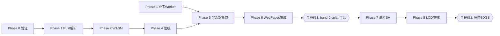

# 完整 3DGS 渲染管线实施计划

> 状态：规划中 · 目标仓库：`worldeditor-next`（渲染引擎）+ `simone-web/WebPages`（宿主集成）
> 背景：测试资产 `data-root/assets/20003/20003.ply` 是 3D Gaussian Splatting 文件；当前引擎仅把它当作按高度着色的点云渲染。本文档规划把它升级为完整的 3DGS 渲染管线。

---

## 1. 目标与范围

**目标**：把 `f_dc/f_rest`（球谐颜色）、`opacity`、`scale`、`rot` 全部解析并渲染为真正的各向异性高斯椭球，带视角相关着色和正确的 alpha 混合。

**当前缺口**（相对完整 3DGS）：

| 数据 | 现状 | 需要 |
|---|---|---|
| `f_dc_0..2` | ✅ 已解码为 band-0 RGB | 保留为 SH 系数 |
| `f_rest_0..44` | ❌ 丢弃 | 高阶 SH（视角相关）|
| `opacity` | ❌ 丢弃 | sigmoid 激活 + 混合 |
| `scale_0..2` | ❌ 丢弃 | exp 激活 → 协方差 |
| `rot_0..3` | ❌ 丢弃 | 归一化四元数 → 协方差 |
| 渲染 | 点（point-list） | 投影椭圆 splat + 排序混合 |

---

## 2. 架构决策

两种主流实现路线：

| 方案 | 描述 | 取舍 |
|---|---|---|
| **A. 实例化四边形 EWA splatting + Worker 排序**（推荐）| 每个高斯 = 1 个屏幕空间 billboard 四边形，顶点着色器投影 3D→2D 协方差，片元按高斯衰减混合；CPU Worker 基数排序 | 成熟（antimatter15/splat、PlayCanvas、three.js），复杂度可控，够编辑器预览 |
| B. 瓦片化 compute 光栅器 | 参考 CUDA 光栅器的 WebGPU 移植：compute 排序 + tile binning + 逐瓦片混合 | 质量/性能最高，但极复杂，对编辑器预览过度设计 |

**采用方案 A。**

**核心技术选择**：

- 高斯数据存 GPU **storage buffer**（只读），每帧只重写**排序索引缓冲**（`u32×N`，4B/splat），避免拷贝大缓冲。
- 顶点着色器：`instance_index → sortedIndex → splatData[sortedIndex]`，逐帧计算 2D 投影 + SH。
- 排序在 **Web Worker**（复用现有 `workerRenderBuffer7` 的 worker 基础设施），相机移动超阈值才重排。

---

## 3. 3DGS 渲染数学（片元级）

**3D 协方差**（世界空间）：

$$\Sigma = R\,S\,S^\top R^\top,\quad S=\mathrm{diag}(e^{s_0},e^{s_1},e^{s_2}),\ R=\text{quat2mat}(\text{normalize}(q))$$

**投影到 2D**（相机空间均值 $t=W\mu$，$W$=view）：

$$J=\begin{bmatrix} f_x/t_z & 0 & -f_x t_x/t_z^2 \\ 0 & f_y/t_z & -f_y t_y/t_z^2 \end{bmatrix},\quad \Sigma' = J\,W_{3\times3}\,\Sigma\,W_{3\times3}^\top J^\top + \begin{bmatrix}0.3&0\\0&0.3\end{bmatrix}$$

（对角项 +0.3 做抗锯齿膨胀，保证 ≥1px）

**Conic 与衰减**：$\text{conic}=\Sigma'^{-1}$，片元 $\alpha=\text{opacity}\cdot\exp(-\tfrac12 d^\top\text{conic}\,d)$，四边形半径取 $\sim3\sqrt{\lambda_{\max}}$。

**视角相关 SH**（方向 $\hat d=\text{normalize}(\mu-\text{camPos})$）：

$$c = \text{SH}_0 f_{dc} + \sum_{l\ge1}\text{basis}_l(\hat d)\,f_{rest} + 0.5,\quad c=\max(c,0)$$

其中 $\text{SH}_0 = \tfrac{1}{2\sqrt{\pi}} \approx 0.28209479$。

**混合**：后到前排序，预乘 alpha，`src=one, dst=one-minus-src-alpha`。

**深度交互**（与路面共存）：splat 在不透明几何之后绘制，`depthCompare: greater`（现有 reverse-Z），`depthWriteEnabled: false`（splat 之间靠排序，不写深度；但被不透明几何正确遮挡）。

---

## 4. 分阶段实施计划

### Phase 0 — 技术验证（spike）

- 用一个已知 splat 文件，在独立 WebGPU demo 里验证"实例四边形 + 单帧 CPU 排序 + band-0 混合"能出正确画面。
- **产出**：确认 MSAA(count=4) 下 splat 混合可接受，或决定改用独立非 MSAA 目标 + 合成。

### Phase 1 — Rust：解析并保留完整 splat 属性

文件：`crates/we-core/src/pointcloud/ply.rs`、`model.rs`、新增 `gaussian.rs`

- 新增 `GaussianCloud` 模型：`positions, sh_coeffs(展平, sh_degree), opacity, scale, rotation`。
- PLY 解析：识别 `f_dc_*`、`f_rest_*`（按数量推断 SH degree）、`opacity`、`scale_*`、`rot_*`。
- 激活：`opacity=sigmoid`、`scale=exp`、`rot=normalize`。
- 预计算 3D 协方差（6 floats 对称），worker 端不做。
- **测试**：Rust 单测——解析属性数量、SH degree 推断、协方差正确性、sigmoid/exp 激活。

### Phase 2 — WASM 绑定

文件：`crates/we-wasm/src/pointcloud.rs`

- `load_gaussian_splats(bytes) -> handle`
- `gaussian_splat_buffer(handle) -> Float32Array`（打包的实例数据，见 §5）
- `gaussian_splat_meta(handle) -> {count, shDegree, aabb, origin}`
- `free_gaussian_splats(handle)`
- 复用现有 origin 平移精度处理。
- **测试**：`wasm-pack test` 往返一致性。

### Phase 3 — 深度排序（Worker）

文件：新增 `frontend/src/viewport/gaussian/sortWorker.ts`

- 输入：splat 位置数组（一次性）、每帧 camPos+viewDir。
- 深度 = `dot(viewDir, μ-camPos)`；16-bit 计数/基数排序（antimatter15 方案）。
- 输出：`Uint32Array` 排序索引（transferable）。
- 相机移动 < 阈值时跳过重排。
- **测试**：排序单调性、边界（0/1 splat）。

### Phase 4 — WebGPU splat 管线

文件：`frontend/src/viewport/pipelineFactory.ts`（新增内联 WGSL + `createGaussianSplatPipeline`）

- 新 bind group：相机 uniform（viewProj, camPos, focal, viewport, shDegree）+ splat storage buffer。
- 顶点着色器：`instance_index → sortedIndex`，读 storage，算 2D conic + SH 颜色，输出四边形角 + conic + 预乘色。
- 片元着色器：高斯衰减 × opacity，预乘 alpha 输出。
- pipeline：blend 预乘 over，`depth32float / greater / write=false`，MSAA 对齐主目标，四边形 triangle-strip 实例化。
- **测试**：pipeline 创建冒烟测试（复用现有 `renderer.test.ts` 模式）。

### Phase 5 — 渲染器集成

文件：`frontend/src/viewport/renderer.ts`、`rendererFrame.ts`

- 复用已加的**独立缓冲**模式（`actorPointCloudMeshes` 的思路）：新增 `gaussianSplatBuffer/count/sortedIndexBuffer/bindGroup`。
- `uploadGaussianSplats(buffer, count, shDegree)` / `updateSplatOrder(indices)` / `clearGaussianSplats()`。
- 渲染 pass：**在不透明几何之后**绘制 splat（`RendererFrameInternals` 加字段 + draw 分支）。
- 相机移动时触发 worker 重排 → `updateSplatOrder`。
- `captureFrame` 复用同 pass → 缩略图自动覆盖。

### Phase 6 — SDK 桥接 + WebPages 集成

文件：`frontend/src/integration/rnkNextSdk.ts`、WebPages `sdk.ts`/`types.ts`/`WorldEditorNextEngine.ts`/`engineConfig.ts`/`Scene3DController.tsx`

- SDK：`uploadGaussianSplats/clearGaussianSplats`（可选方法，旧 bundle 降级）。
- engineConfig：`npcRenderMode: "box" | "points" | "splat"`。
- Scene3DController：NPC 的 `.ply` 走 splat 路径（fetch → `load_gaussian_splats` → 上传 + 排序）。
- 独立 app：点云查看器 color mode 之外加 "splat" 模式（默认 elevation 需切换）。

### Phase 7 — 视角相关高阶 SH

- 顶点着色器实现 degree 1–3 SH 求值（band-0 已在 Phase 4）。
- 权衡：全 SH 每 splat 48 系数（内存/带宽大）→ 提供 `maxShDegree` 配置降级。

### Phase 8 — LOD / 抽稀 / 性能

- 按屏幕投影面积/距离剔除微小 splat；splat 数超预算时按 opacity×size 抽稀（复用 `maxPointsPerActor` 思路）。
- 多 NPC：每个模型独立 storage buffer + 独立排序，或合并 + 全局排序。

---

## 5. 实例数据布局（GPU storage buffer）

**紧凑方案**（预计算协方差 + band-0 快路径，32B/splat）：

| 字段 | 类型 | 字节 |
|---|---|---|
| position | 3×f32 | 12 |
| cov3d（对称6）| 6×f16 | 12 |
| color(band0) | 3×f16 | 6 |
| opacity | 1×f16 | 2 |

**全 SH 方案**（视角相关，~120B/splat）：pos(12) + cov3d(12) + SH(48×f16=96) + opacity。

内存估算：1M splat → 紧凑 32MB / 全 SH 120MB。排序索引 4MB。

---

## 6. 测试策略

- **Rust 单测**：属性解析、SH degree 推断、激活函数、协方差、往返。
- **WASM 测试**：`wasm-pack test` 缓冲一致性。
- **Worker 单测**：排序正确性/单调性/边界。
- **管线冒烟测试**：pipeline 创建（headless 或 mock device）。
- **视觉回归**：复用仓库现有 Playwright visual-regression，加一个已知 splat 的基准截图。
- **性能基准**：1M splat 的排序耗时 + 帧时间。

---

## 7. 性能预算与风险

| 风险 | 影响 | 缓解 |
|---|---|---|
| 百万级 splat 内存 | 120MB+ | f16 打包、band-0 快路径、LOD 抽稀 |
| 每帧 CPU 排序 | 卡顿 | Worker + 移动阈值重排；后期 GPU 基数排序 |
| MSAA 下 splat 混合 | 边缘质量/性能 | 独立非 MSAA float 目标 + 合成 |
| reverse-Z 深度交互 | splat 与路面遮挡错误 | `greater` + `write=false`，Phase 0 验证 |
| 顶点着色器读 storage | 兼容性 | WebGPU 支持顶点只读 storage；否则改 texture |
| 全 SH 带宽 | 帧率 | `maxShDegree` 降级，默认 degree 1–2 |

---

## 8. 出货流程（每次 Rust/WASM 改动后）

沿用已验证的链路：

1. `wasm-pack build crates/we-wasm --target web --out-dir ../../frontend/wasm/pkg --release`
2. `vite build --config vite.rnk-next.config.ts`
3. 拷贝 `dist-rnk/worldeditor-next-sdk.js` + `wasm/pkg/we_wasm_bg.wasm` → `WebPages/src/vendor/we-next/`
4. WebPages `tsc` + 语法/wasm magic 校验

---

## 9. 里程碑排序

- **里程碑 1（band-0 splat）**：Phase 0–6 完成 → 正确椭球形状 + 基础颜色 + 混合，已远超当前点云。
- **里程碑 2（完整 3DGS）**：+ Phase 7–8 → 视角相关着色 + LOD，达到图一级别。

---

## 附录 A — 关键代码位置参考

| 组件 | 文件 |
|---|---|
| PLY 解析器 | `crates/we-core/src/pointcloud/ply.rs` |
| 点云模型 | `crates/we-core/src/pointcloud/model.rs` |
| 渲染缓冲构建 | `crates/we-core/src/pointcloud/render.rs` |
| WASM 绑定 | `crates/we-wasm/src/pointcloud.rs` |
| 管线工厂（内联 WGSL）| `frontend/src/viewport/pipelineFactory.ts` |
| 渲染器 | `frontend/src/viewport/renderer.ts` |
| 渲染 pass | `frontend/src/viewport/rendererFrame.ts` |
| SDK 桥接 | `frontend/src/integration/rnkNextSdk.ts` |
| 宿主引擎适配 | `WebPages/src/utils/rnk-next/WorldEditorNextEngine.ts` |
| 宿主 3D 场景控制器 | `WebPages/src/views/CaseEdit/MarkerLayer/Scene3D/Scene3DController.tsx` |

## 附录 B — 现有基础（已完成，可复用）

- 独立 actor 点云 GPU 缓冲（`actorPointCloudMeshes`）——splat 缓冲可沿用同模式。
- PLY 的 `f_dc` → band-0 RGB 解码（`sh_dc_to_u8`）——Phase 1 保留 SH 系数的前置。
- origin 平移精度处理（大坐标 → f64 保精度后偏移）。
- WASM/bundle 重建 + 向 WebPages re-vendor 的完整链路。
