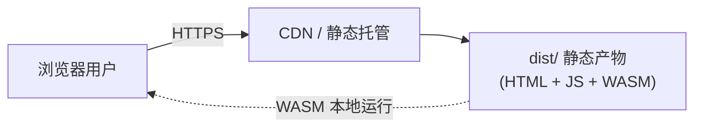

# 云端部署指南

> 适用版本：0.4.0 · 更新日期：2026-07-27

本文档说明如何将 **WorldEditor Next** 的 Web 端部署到云端。

## 1. 概述：当前只需部署纯前端

WorldEditor Next 的 **Web 端是一个纯静态单页应用（SPA）**：

- 所有编辑逻辑通过 **WASM（`we-wasm`）在浏览器本地运行**；
- 文件读写走浏览器 File API / IndexedDB（`WebPlatformService`，见 [frontend/src/services/web.ts](../frontend/src/services/web.ts)）；
- **前端当前不调用 `we-server` REST API**（后端接线是 Phase 3 计划项）。

因此，**部署 Web 端只需要托管构建产物 `dist/` 静态目录即可**，无需 PostgreSQL、Redis、`we-server` 等后端组件。

| 组件 | Web 端部署是否需要 |
| --- | --- |
| 前端静态站点（`dist/`） | ✅ 必需（唯一必需项） |
| `we-server`（REST API） | ❌ 前端不调用，跳过 |
| PostgreSQL | ❌ 仅 `we-server` 使用，跳过 |
| Redis | ❌ 代码未使用，跳过 |

> 若未来启用服务端（项目云存储 / 协作），参见文末[附录 A：服务端部署](#附录-a服务端部署future-work)。桌面版（Tauri）打包发布不在本文范围，参见 `just bundle` 与 `.github/workflows/release.yml`。

### 部署拓扑



---

## 2. 前置条件

- **Node.js 18+** 与 **Yarn 1.x**（前端构建）
- **Rust toolchain** 与 **wasm-pack**（构建 WASM 产物）
  ```bash
  cargo install wasm-pack
  ```
- 可选：**wasm-opt**（进一步压缩 WASM 体积，release 构建自动调用）
- 一个静态托管目标：Nginx 服务器 / Vercel / Netlify / 对象存储 + CDN 任选其一

---

## 3. 构建 Web 端产物

分两步：先构建 WASM，再构建前端。

### 3.0 一键构建（推荐 CI/CD 使用）

无需手动分步，直接运行一键脚本，产出完整的 `frontend/dist/` 产物：

```bash
just build-web
# 等价于：node scripts/build-web.mjs
```

该脚本（[scripts/build-web.mjs](../scripts/build-web.mjs)）依次执行：Release WASM 构建 → `wasm-opt -Oz` 优化 → `yarn build:web`，最终校验 `frontend/dist/index.html` 存在。可选参数：`--skip-wasm`（复用已有 WASM）、`--skip-install`（跳过 `yarn install`）。

CI/CD 中直接调用此脚本产出制品，随后打包为 Docker 镜像（见[第 4.5 节](#45-docker-镜像nginx--cicd)）。若需手动分步，见下方 3.1 / 3.2。

### 3.1 构建 WASM（全功能桌面/Web 模块）


```bash
# Release 构建，输出到 frontend/wasm/pkg/
just build-wasm-release
```

等价命令：
```bash
wasm-pack build crates/we-wasm --target web \
  --out-dir ../../frontend/wasm/pkg --release -- --features extra-modules
```

> ⚠️ 必须使用 `frontend/wasm/pkg/`（FULL 构建，含 gis/elevation/measure/spline/io/junction_ops/topology/validation 全模块）。
> 不要用 `pkg-slim/`（那是 rnk-next SDK 专用的精简构建）。

### 3.2 构建前端静态站点

```bash
cd frontend
yarn install          # 首次或依赖变更时
yarn build:web        # 产出到 frontend/dist/
```

`build:web` 使用 Vite `web` 模式，会**排除 `@tauri-apps/*`** 依赖（见 [vite.config.ts](../frontend/vite.config.ts)），输出目录为 `frontend/dist/`。

构建产物结构：
```
frontend/dist/
├── index.html
├── assets/            # 打包后的 JS/CSS（含 vendor 分块）
└── ...                # WASM 及静态资源
```

---

## 4. 静态托管部署

### 4.1 Nginx（推荐，自托管）

将 `frontend/dist/` 上传到服务器（例如 `/var/www/worldeditor`），配置 Nginx：

```nginx
server {
    listen 80;
    server_name editor.example.com;

    root /var/www/worldeditor;
    index index.html;

    # 正确的 WASM MIME 类型（关键：否则浏览器拒绝流式编译）
    types {
        application/wasm wasm;
    }

    # 静态资源长缓存（文件名带 hash，可安全长缓存）
    location /assets/ {
        expires 1y;
        add_header Cache-Control "public, immutable";
    }

    # WASM 与其它静态文件：开启压缩
    gzip on;
    gzip_types application/javascript application/wasm text/css application/json;

    # SPA 回退：所有未匹配路由交给 index.html
    location / {
        try_files $uri $uri/ /index.html;
    }
}
```

**要点：**
- **`application/wasm` MIME 必须正确**，否则 `WebAssembly.instantiateStreaming` 会失败。
- **SPA fallback**（`try_files ... /index.html`）必需，否则刷新子路由会 404。
- `index.html` 本身**不要**长缓存（默认即可），以便发布新版本后用户能拉到最新入口。

启用 HTTPS 推荐用 [Certbot / Let's Encrypt](https://certbot.eff.org/)：
```bash
certbot --nginx -d editor.example.com
```

### 4.2 Vercel

项目根目录创建 `vercel.json`（或在 Dashboard 配置）：

- **Build Command**：`cd .. && just build-wasm-release && cd frontend && yarn build:web`
  （需在构建环境安装 Rust + wasm-pack；若不便，可改为在 CI 预构建 `dist/` 后仅部署静态产物）
- **Output Directory**：`frontend/dist`
- **Rewrites**：`{ "source": "/(.*)", "destination": "/index.html" }`（SPA fallback）

> Vercel 默认对 `.wasm` 返回正确的 `application/wasm`，无需额外配置 MIME。

### 4.3 Netlify

`netlify.toml`：
```toml
[build]
  command = "yarn build:web"
  publish = "frontend/dist"

[[redirects]]
  from = "/*"
  to = "/index.html"
  status = 200
```

> 同样需要在构建环境预先生成 `frontend/wasm/pkg/`（Rust + wasm-pack）。若托管平台不便安装 Rust，建议在 GitHub Actions 中构建好 `dist/`，再作为静态产物部署。

### 4.4 对象存储 + CDN（阿里云 OSS / AWS S3 / 腾讯 COS）

1. 将 `frontend/dist/` 上传到 Bucket。
2. 配置 Bucket 静态网站托管，**默认首页与错误页均指向 `index.html`**（实现 SPA fallback）。
3. **确认 `.wasm` 文件的 `Content-Type` 为 `application/wasm`**（部分对象存储需手动设置元数据）。
4. 前置 CDN，对 `assets/*` 开启长缓存、对 `.wasm`/`.js` 开启 Brotli/Gzip 压缩。

### 4.5 Docker 镜像（Nginx） + CI/CD

推荐的云端部署方式：将 `dist/` 打包为轻量 Nginx 镜像，产物即镜像，可直接拉取到任意云服务器运行。

**本地一键构建镜像：**
```bash
just docker-web                                  # 构建 dist + 打包镜像 worldeditor-web:latest
just docker-web tag=my-registry/worldeditor-web:1.0   # 自定义标签
```

镜像由 [Dockerfile.web](../Dockerfile.web)（`FROM nginx:1.27-alpine`）构建，直接拷贝预构建的 `frontend/dist/` 与 [docker/nginx.web.conf](../docker/nginx.web.conf)（内置 `application/wasm` MIME、gzip、SPA fallback、`/healthz` 健康检查）。镜像**不含** Rust/Node 工具链，体积小、启动快。

> 注意：`Dockerfile.web` 只拷贝已构建的 `frontend/dist/`。直接 `docker build` 前需先运行 `just build-web`（`just docker-web` 已自动包含此步）。

**本地运行验证：**
```bash
docker run --rm -p 8080:80 worldeditor-web:latest
# 访问 http://localhost:8080 ，健康检查 http://localhost:8080/healthz
```

**CI/CD 自动发布：** 工作流 [.github/workflows/deploy-web.yml](../.github/workflows/deploy-web.yml) 在推送 `v*` 标签或手动触发时：

1. **build-artifact**：安装 Rust + wasm-pack + Node 22，运行 `node scripts/build-web.mjs` 产出 `dist/`，作为 `web-dist` 制品上传；
2. **docker**：下载制品，通过 `Dockerfile.web` 构建镜像并推送到 **GHCR**（`ghcr.io/<owner>/worldeditor-web`），标签由 git tag 自动派生（语义化版本 + `latest`）。

**云服务器部署：**
```bash
docker pull ghcr.io/<owner>/worldeditor-web:latest
docker run -d --name worldeditor-web --restart unless-stopped \
  -p 80:80 ghcr.io/<owner>/worldeditor-web:latest
```

> 若镜像仓库为私有，服务器需先 `docker login ghcr.io`。生产环境建议在镜像前再置一层带 TLS 的反向代理（或用云负载均衡终止 HTTPS）。

---

## 5. 安全与性能注意事项

- **CSP（内容安全策略）**：Web 端使用 `protobufjs` 解析 `.geoz`，其解码器依赖运行时 `Function()` 代码生成。若你在托管层添加 CSP 响应头，**必须包含 `'unsafe-eval'` 与 `'wasm-unsafe-eval'`**（`script-src`），否则 `.geoz` 导入及 WASM 加载会失败。默认静态托管不加 CSP 头则无此问题。
- **压缩**：`.wasm` 与 `.js` 体积较大，务必开启 Brotli 或 Gzip，可显著降低首屏加载。
- **缓存策略**：`assets/*`（带内容 hash）长缓存 + immutable；`index.html` 不缓存或短缓存。
- **数据存储**：Web 端数据仅保存在**用户浏览器本地**（IndexedDB / File API），清除浏览器数据即丢失，且**无多端同步**。如需云端持久化/协作，须启用服务端（见附录 A）。

---

## 6. 发布与更新流程

1. 更新版本号（`frontend/package.json`）。
2. 重新构建：`just build-wasm-release && cd frontend && yarn build:web`。
3. 上传/发布新的 `dist/` 到托管目标。
4. 确认 `index.html` 未被长缓存，用户刷新即可加载新版本（`assets/*` 因文件名带 hash 自动失效旧缓存）。

---

## 附录 A：服务端部署（Future Work）

> 以下内容仅在**未来启用服务端功能**（项目云存储、多用户、协作编辑）时需要。当前 Web 前端**不依赖**这些组件。

项目已提供基于 Docker Compose 的后端栈（[docker-compose.yml](../docker-compose.yml)）：`we-server`（Axum REST API，端口 3000）+ PostgreSQL 16 + Redis 7（Redis 目前代码未使用）。

### 必需环境变量

Compose 通过 `:?` 强制校验以下变量，缺失将拒绝启动：

| 变量 | 是否必需 | 默认值 | 说明 |
| --- | --- | --- | --- |
| `POSTGRES_PASSWORD` | ✅ | 无 | PostgreSQL 密码 |
| `JWT_SECRET` | ✅ | 无 | JWT 签名密钥，**至少 32 字符**，用强随机值 |
| `ADMIN_USER` | ✅ | 无 | 初始管理员账号（当前为 env 校验，非数据库用户） |
| `ADMIN_PASS` | ✅ | 无 | 初始管理员密码 |
| `POSTGRES_USER` | ❌ | `postgres` | PostgreSQL 用户名 |
| `POSTGRES_DB` | ❌ | `worldeditor` | 数据库名 |
| `CORS_ORIGINS` | ❌ | `http://localhost:5173,http://localhost:3000` | 允许跨域来源，逗号分隔；生产必须设为前端实际域名 |
| `RUST_LOG` | ❌ | `info` | 日志级别 |

### 一键启动

在项目根目录创建 `.env`：
```dotenv
POSTGRES_PASSWORD=<强随机密码>
JWT_SECRET=<至少32字符的强随机字符串>
ADMIN_USER=admin
ADMIN_PASS=<强随机密码>
CORS_ORIGINS=https://editor.example.com
```

启动：
```bash
docker compose up -d --build
```

- `we-server` 启动时自动执行 `migrations/`（`sqlx::migrate!`）创建 `projects` / `files` 表。
- 服务监听 **`0.0.0.0:3000`**（端口在代码中硬编码，见 [crates/we-server/src/main.rs](../crates/we-server/src/main.rs)；如需改对外端口，用 Compose 端口映射或反向代理）。
- 文件存储在卷 `uploads_data`（`/app/uploads`）；S3 后端为未实现的 stub。

验证：
```bash
curl -X POST http://localhost:3000/api/auth/login \
  -H 'Content-Type: application/json' \
  -d '{"username":"admin","password":"<ADMIN_PASS>"}'
```

### 反向代理（前端 + 后端同域）

若将来前端接入后端，可用 Nginx 统一入口：
```nginx
location /api/ {
    proxy_pass http://127.0.0.1:3000;
    proxy_set_header Host $host;
    proxy_set_header X-Forwarded-For $proxy_add_x_forwarded_for;
}
```

### 已知限制

- **前端 Web 端尚未接入 REST API**——当前 Web 与后端相互独立运行。
- Redis 在 Compose 中存在但代码未引用，可移除。
- 认证为开发级（env 变量校验），生产需迁移到数据库用户体系。
- S3 存储、CRDT/OT 协作冲突合并、完整插件沙箱隔离均为后续项。
- 数据库端口 `5432` 生产环境不应对公网开放。
